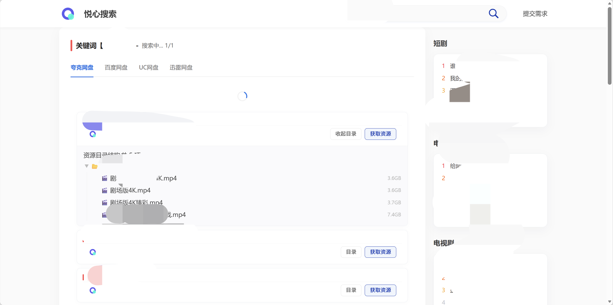
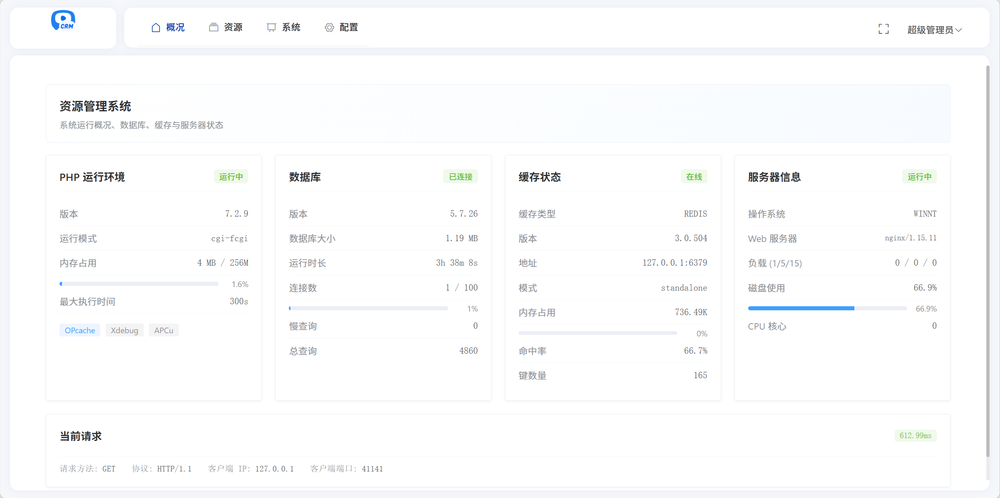
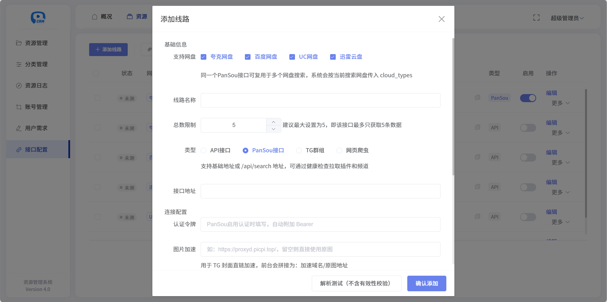
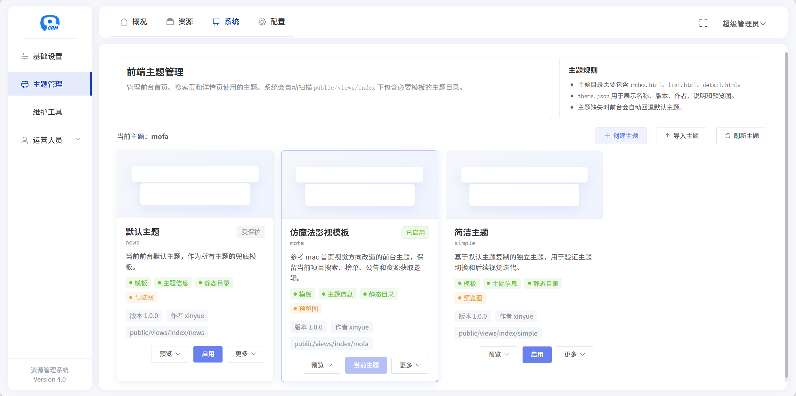
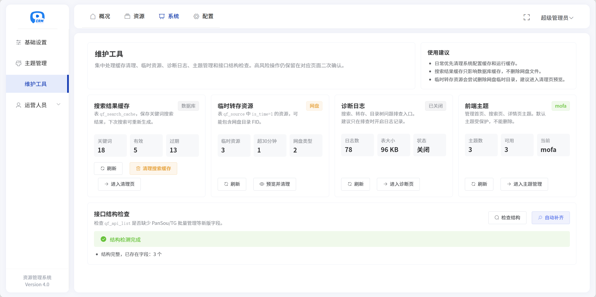
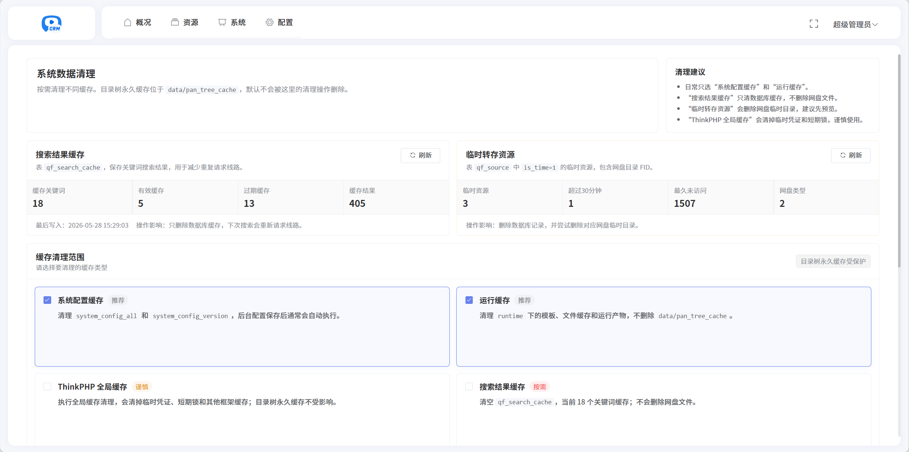

## ❤️ 网盘资源管理系统

**支持多网盘转存分享，支持夸克网盘、百度网盘、阿里云盘、UC网盘、迅雷云盘，网盘资源管理与索引工具！**

> 本项目基于心悦搜索 [675061370/xinyue-search](https://github.com/675061370/xinyue-search) 修改和扩展而来，感谢原作者的开源基础与项目思路。本仓库主要面向个人学习、二次开发和主题/搜索体验优化。

---

## 🔔 温馨提示

📌 **本项目仅供技术交流与学习使用**，自身不存储或提供任何资源文件及下载链接。

📌 **请勿将本项目用于任何违法用途**，否则后果自负。

📌 **项目本身不集成任何第三方资源采集源或链接信息**，所有功能需由用户自行配置。

📌 如有任何问题或建议，欢迎交流探讨！ 😊

> **免责声明**：本项目由  AI 辅助编写。由于时间有限，仅在空闲时维护。如遇使用问题，请优先自行排查，感谢理解！

---

## 🔒 法律声明与使用协议（Legal Disclaimer & Terms of Use）

- **使用本项目即表示您同意以下条款：**
1. 本项目为开源项目，仅供技术学习与交流使用；
2. 项目未集成任何资源文件、下载地址或版权内容；
3. 项目不提供也不支持任何侵犯版权、传播盗版等非法行为；
4. 若用户将本项目用于搭建违法网站或传播侵权资源，责任由用户自行承担，与项目作者无关；
5. 本项目作者不对因使用本项目而产生的任何直接或间接后果承担法律责任；
6. 若您不同意上述条款，请勿下载、使用或传播本项目；

---

## 📄 许可证

**本项目采用 MIT 许可证。详情请见 <a href="./LICENSE">LICENSE</a> 文件。**

---

## 🚀 更新日志

### Yuexin Search 4.0

当前 4.0 版本在原版心悦搜索基础上，重点围绕搜索体验、缓存体系、网盘有效性检测、后台配置体验和前台主题能力进行了增强。

#### 核心功能

- 支持夸克网盘、百度网盘、阿里云盘、UC 网盘、迅雷云盘等多网盘资源管理与索引。
- 支持资源搜索、分类展示、搜索历史、搜索结果聚合与网盘类型筛选。
- 支持后台配置资源接口、转存参数、搜索参数、主题设置、公告弹窗等常用站点配置。
- 支持安装程序初始化数据库，适合全新部署和后续升级维护。

#### 相较原版的主要改变

- **多种缓存模式**：补充搜索结果缓存、目录树缓存、运行缓存、后台清理入口等能力，减少重复请求，提高搜索和资源弹窗响应速度。
- **搜索接口逻辑优化**：优化关键词搜索流程、搜索结果缓存写入节奏、本地资源优先显示、搜索联想词、移动端搜索页体验和 PC 顶栏搜索跳转逻辑。
- **网盘有效性检测增强**：搜索结果展示前增加有效性校验逻辑，并支持接入第三方检测接口，降低失效资源出现在前台的概率。
- **目录树缓存独立化**：将网盘目录树缓存独立到 `data/pan_tree_cache`，避免和 ThinkPHP 运行缓存混在一起，方便单独管理和清理。
- **主题系统增强**：支持多个前台主题模板，后台可配置当前主题；新增并持续优化 `mofa` 主题。
- **主题自定义能力**：支持 Banner、底部导航、友链、下载入口、公告弹窗、首页展示内容等主题配置。
- **mofa 主题移动端优化**：优化首页沉浸式轮播背景、移动端搜索联想、底部 tabs、夜间模式、资源弹窗、发现页和我的页显示效果。
- **mofa 主题 PC 端优化**：调整首页 PC 布局，保留 Banner 与热门推荐；优化 PC 顶栏、轮播图、发现页宽屏布局和常用入口。
- **后台设置体验优化**：将原本字段堆叠式配置逐步整理为更成熟的配置元素，补充类型提示、校验和图片比例显示优化。
- **公告弹窗优化**：对接后台公告接口，并调整为更贴近 iOS 风格的弹窗；支持公告 HTML 内容中的复制交互和轻提示。
- **提交反馈入口**：移植默认模板的反馈功能到 mofa 主题，PC 端放在顶栏，移动端放在“我的”页常用功能。
- **安装流程修复**：修复全新安装完成后跳转完成页时被 `install.lock` 拦截的问题。
- **开源整理**：增加 `.env.example`、更完整的 `.gitignore`，排除运行日志、安装锁、测试缓存和本地敏感配置。

#### 说明

- 本项目不内置任何资源内容，所有接口、资源链接和网盘配置均需使用者自行配置。
- `data/pan_tree_cache` 为运行时目录树缓存目录，仓库仅保留占位文件，缓存内容不应提交。
- 当前仓库保留 `vendor/` 以方便直接部署运行；后续可进一步整理为标准 Composer 依赖管理模式。

#### 维护接口

临时转存资源会写入资源表并标记为 `is_time=1`。可通过定时任务调用以下接口清理：

```text
/api/other/delete_search
```

默认删除 `update_time` 超过 30 分钟的临时资源。

```text
/api/other/delete_search?expire_minutes=10
```

删除 `update_time` 超过 10 分钟的临时资源。`expire_minutes` 最小为 1，最大为 10080。

```text
/api/other/delete_search?force=1
```

强制删除所有 `is_time=1` 的临时资源，不再判断 `update_time`。该参数适合手动排查或彻底清理，定时任务请谨慎使用。

---

## 🔌 推荐配套项目

为了获得更完整的搜索聚合与网盘有效性检测体验，推荐配合以下开源项目使用：

- **PanSou**：[fish2018/pansou](https://github.com/fish2018/pansou)  
  可作为资源搜索聚合服务使用，用于对接搜索接口，扩展资源来源和搜索能力。

- **PanCheck**：[Lampon/PanCheck](https://github.com/Lampon/PanCheck/)  
  可作为网盘链接有效性检测服务使用，用于对接第三方检测接口，降低失效资源展示概率。

> 以上项目需用户自行部署、配置和维护。本项目仅提供对接能力与配置入口，不内置任何第三方资源源或检测服务。

---

## 📖 搭建教程

📌 **<a href="https://tcn6g7hyxvir.feishu.cn/wiki/WYT4wZtrjijeswkI0RSc4ofTnah" target="_blank">完整搭建教程</a>**

---

## 🌟 项目截图

### **PC 前台**




### **移动端**


### **后台管理**







---

## 💬 交流 & 讨论

 

📌 **添加微信**  添加时请备注来源（如果项目对你有所帮助，也可以请我喝杯咖啡 ☕️ ~）

📌 **扫码** 👇

|  |  |
| --- | --- |

> **温馨提示**：项目代码免费开放，但不提供搭建服务，如有问题可在群内讨论或私信咨询。

---

## Community

LinuxDO（https://linux.do/）: sincere, friendly, united, and professional

---
